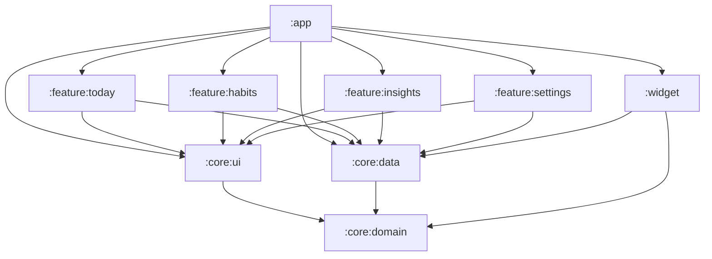

# Architecture: Gawi (Android)

Engineering companion to [the PRD](prd.md). The PRD says *what* and *why*;
this document fixes *how*. It records decisions, not aspirations — if a
decision changes, change it here first.

**Status:** agreed baseline before scaffolding (2026-08-16).

---

## 1. Principles

1. **Offline-first, verifiably.** The MVP APK declares no network permission.
   Every feature must work with the radio off, forever.
2. **The event log is the source of truth.** All user data is an append-only
   log of events in local SQLite. Everything the UI shows is derived from it
   and can be thrown away and rebuilt.
3. **Sync-ready from day one.** Future sync (LAN in Phase 2, E2E cloud in
   Phase 3) is defined as: union of two event logs, dedupe by event UUID,
   tombstones handle deletes. Nothing in the MVP schema may make that require
   a data migration.
4. **The domain is pure Kotlin.** `:core:domain` has zero Android imports.
   Dates, streaks, event replay — the correctness-critical logic — runs and is
   tested on the plain JVM.
5. **Events are immutable.** The log is never rewritten. Fixes and undos are
   new events; schema evolution is handled by upcasting on read (§3).
6. **Commands are validated; events are not.** Business rules (the 3-day
   retro window, "habit exists", etc.) guard the *command* path — a user
   trying to do something now. The apply/replay path accepts any well-formed
   event unconditionally. Replay must never be able to fail on data that was
   once valid; sync and import depend on this.

## 2. Module structure

Now-in-Android convention: Gradle version catalog
(`gradle/libs.versions.toml`), convention plugins in `build-logic/`, and
`core`/`feature` modules. Right-sized for a solo app:

| Module | Contents |
|---|---|
| `:app` | MainActivity, navigation graph, Hilt app wiring, WorkManager scheduling and the reminder notification |
| `:core:domain` | Pure Kotlin/JVM: event types, projection logic, logical-date rules, streak computation, UUIDv7 generator, event and export JSON codecs |
| `:core:data` | Repositories, event store, Room database + DAOs, DataStore settings and the last-export stamp, export/import plumbing and the CSV of completions, and the end-of-day reminder's decision (whether to remind, and when the next wake falls) |
| `:core:ui` | Theme, shared composables, and presentation types shared by more than one feature |
| `:feature:today` | Today view (app home screen, Momo's habitat) |
| `:feature:habits` | Create/edit/archive habit, habit detail |
| `:feature:insights` | Per-habit heatmap and completion-rate trends, tag effort distribution, and Phase 1.5's retrospectives — **all three Phase 1 surfaces are built; the retrospectives are not** |
| `:feature:settings` | Day boundary, week start, reminder time, export and import, the 30-day export nudge |
| `:widget` | Glance home-screen widget |

Dependency rule: `feature → core`, `widget → core`, `app → everything`,
`core:data → core:domain`, `core:ui → core:domain`, and `:core:domain` depends
on nothing but the Kotlin stdlib and kotlinx-serialization.

The diagram is the permitted **direction**, not an exact edge list.
`:feature:today`, `:feature:habits` and `:feature:insights` also name
`:core:domain` directly, while `:app` and `:feature:settings` receive it
transitively — `:core:data` and
`:core:ui` both expose it with `api`, for the reasons their build files record.
Drawing today's import list instead would make that difference look like a rule,
and would be wrong the day a module adds an import.

Two things the picture carries better than the line above it. **`widget →
core:ui` is absent**, which is deliberate and explained below. And
`:core:domain` is the only sink, which is the whole point.

`core:ui → core:domain` was added 2026-08-21 with habit detail, which made the
Today view's `StreakUi` a thing two feature modules need — and feature modules
cannot see each other. It carries the type and its `StreakSnapshot` mapper, so
PRD §6.6's two streak surfaces share one days-versus-weeks rule rather than two
copies that drift. Nothing about the rule that matters changes: `:core:domain`
is pure Kotlin and cannot import Android, so a UI module depending on it moves
no domain logic anywhere.

This table fixes the **target shape**, not the creation order. Scaffolding
starts with `:app`, `:core:domain`, and `:core:data`; each remaining module is
created when its first screen is built. What is non-negotiable from day one is
the dependency rule — in particular that domain logic never lands in a module
where it can import Android.

Built so far: `:app`, `:core:domain`, `:core:data`, `:core:ui`,
`:feature:today`, `:feature:habits`, `:feature:settings` and — as of 2026-08-21
— **`:widget`**, which is the first module here that is not a screen. Its
decisions are in [docs/ux/widget.md](ux/widget.md). It takes `:core:data` and
`:core:domain` and deliberately **not** `:core:ui`: a Glance tree is
`RemoteViews` under the composition, so it cannot consume a Compose UI theme or
a shared composable, and the module rule (`widget → core`) is satisfied without
the one dependency that looks obvious. `app/src/debug/` is gone: the debug-only
activity that set the day cutoff and the reminder time over `adb` was deleted
when `:feature:settings` landed, and there is no debug source set anywhere in
the project now.

**`:feature:insights` is the ninth row**, added to this table on 2026-08-23 for
PRD §5's Phase 1 and **built on 2026-08-24** — all three of its surfaces, across
two screens. The per-habit history screen holds the month grid and the
completion-rate trend and is reached from habit detail; `Destination.Insights` is
a **top-level** destination holding the tag distribution and a per-habit
adherence list over one period, reached from a third action in Today's app bar.
That second screen is the app's only report on every habit at once, and it is
where PRD §5's Phase 1.5 retrospectives will grow from. It gets its own module rather than a corner of
`:feature:habits`, which is worth recording because the heatmap is *per habit*
and reached from habit detail, so the corner looks right. Two things say
otherwise. The navigation rule below makes "reached from habit detail" free: a
feature exposes Route composables taking plain lambdas, so habit detail's "see
full history" is a lambda and `:app` decides it lands in another module — no
cross-feature dependency, which feature modules could not have anyway. **That is
now built rather than argued**: `HabitDetailActions.onHistory` is the lambda,
`Destination.HabitHistory` is where `:app` sends it, and neither feature module
names the other. And the third surface settles it, because **tag effort
distribution is not per-habit** — one number per tag across every habit — so it
has no home in `:feature:habits` under any reading, and splitting the two would
push their first shared piece into `:core:ui` for no reason. PRD §5's Phase 1.5
retrospectives are this module's second job, so the room is not speculative.
[docs/ux/insights.md](ux/insights.md) is the record — a sketch for the two
unbuilt surfaces and, in its §8, what building the heatmap settled. `insights`
was in `scope-enum` in `.commitlintrc.yaml` before its first commit, as this
table's own rule about module scopes requires.

Building it also moved two pieces of shared presentation into `:core:ui`, which
is that module's rule working as intended rather than a detour: `GlyphButton`
existed identically in `:feature:habits` and `:feature:settings`, and the seven
weekday labels existed as letters in one and spelled-out names in the other. The
history screen would have been the third copy of each. `:core:ui` gained its
first `res/` directory in the process — the one docs/ux/visual-identity.md §5
expects to hold the bundled variable font.

`:feature:settings` holds the three preferences the data layer stores — day
boundary, week start and reminder time — and, below them in a labelled section
of their own, **export and import**. They are a section rather than two more
setting rows because they are not settings: they have no stored value, and
between them they are the only disaster-recovery path there is, `allowBackup`
being off (§6) and the event log reconstructible from nothing. The export row
does now carry one stored value — how long ago it last wrote a file — which is
§6's compensating control and the whole of PRD §5's nudge;
`docs/ux/settings.md` §6 has the copy decisions. **The CSV of completions is
built too**, as of 2026-08-21, which completes PRD §5's data row — a third row
in the same section, deliberately not a recovery path, and the one row there
whose help line has to say so.

The CSV lives in `:core:data` as this table's row for that module says, and its
being there rather than in `:core:domain` is worth one sentence: unlike the
export codec it needs no kotlinx-serialization, so putting it here leaves the
boundary guard below intact. It also never touches the last-export stamp, which
is enforced by the class that writes it not being given `ExportJournal` at all
rather than by a comment asking for restraint.

**The export codec is in `:core:domain`, not `:core:data`**, which is the one
place this table's `:core:data` row would once have said otherwise. An export
embeds each payload as nested JSON rather than as an escaped string — the "open
formats" half of the PRD's data-ownership promise, so that `jq` can walk the
file — and doing that means parsing `EncodedPayload.json`, i.e. knowing that the
domain's opaque payload string is JSON at all. That knowledge belongs in the
package that already has it. The consequence is worth stating because it is
load-bearing: `:core:data` has no kotlinx-serialization dependency, in main or
in test, so that dependency appearing there later is a signal this boundary has
been crossed.

**`:app` owns navigation, and no other module depends on a navigation
library.** A feature module exposes Route composables taking plain lambdas, so
a screen reports what happened to it and `:app` decides where that goes. Two
things follow, and both are worth keeping: a feature's tests never need a
`NavController`, and a screen cannot navigate somewhere its own module has no
business knowing about. Concretely, feature modules take
`androidx.hilt:hilt-lifecycle-viewmodel-compose` for `hiltViewModel()` and not
`hilt-navigation-compose`, whose pom would put navigation on their classpath.

Routes are **type-safe** — `@Serializable` classes in
`app/src/main/kotlin/com/gawi/app/navigation/`, not string templates — so an
argument that changes shape is a compile error rather than a null at runtime.
Habit ids cross that boundary as `String`, because `HabitId` rejects a
non-canonical UUIDv7 by throwing and a route argument is exactly where an
unexpected value arrives; it is validated inside the screen's ViewModel.

## 3. Event model

One `events` table, append-only:

| Column | Type | Notes |
|---|---|---|
| `id` | TEXT, PK | UUIDv7 (time-ordered; hand-rolled in `:core:domain`, ~20 lines + tests, no dependency) |
| `type` | TEXT | Event type discriminator |
| `schema_version` | INTEGER | Version of this event type's payload shape |
| `occurred_at` | INTEGER | Epoch millis (instant) |
| `tz_offset_min` | INTEGER | Device UTC offset at write time, for audit |
| `payload` | TEXT | JSON via kotlinx.serialization |

Event types at MVP:

- `HabitCreated` — name, icon/color, schedule (`daily` or `weekly(n)`),
  optional tag
- `HabitUpdated` — changed habit metadata
- `HabitArchived`
- `HabitUnarchived`
- `CompletionAdded` — habit id, `logical_date`, optional note
- `CompletionTombstoned` — references the `CompletionAdded` event id
- `CompletionNoteUpdated` — references the `CompletionAdded` event id, new
  note text (the PRD's long-press/detail flow attaches notes after the tap).
  Empty text is a valid write and clears the note; it participates in LWW
  like any other note write (§4, note resolution).

**Conflict resolution (LWW):** where two events contend (habit metadata, a
completion's note), last-write-wins by `occurred_at`, ties broken by event id
— UUIDv7 gives a deterministic total order for free. `HabitUpdated` is
**whole-record** LWW, not per-field merge; per-field is CRDT territory this
app does not need. Clock skew between one person's devices is an accepted
risk.

**Settings are not events.** Day boundary, week start, reminder time, and
timezone behavior are device-local preferences in DataStore. They never sync
and never enter the log.

**Schema evolution:** payloads carry `schema_version`; readers upcast old
versions to the current shape at deserialization time. The log is never
migrated in place — replaying a years-old log through current code must always
work (PRD §7 "migrations replay-safe").

An export carries two version numbers and they mean different things. The
envelope has a `format_version`, which says how to find the events; each event
carries the `schema_version` above, which describes one payload. A newer
envelope full of v1 payloads is an ordinary file, and so is the reverse. A
reader must establish the envelope version *before* it decodes anything else,
so that a file from a newer build is refused as unsupported rather than as
corrupt — the log has one writer and an unknown shape there is corruption, but
a file is picked by a user and may legitimately come from the future. Payload
bytes travel verbatim through both directions of an export, because decoding
and re-encoding would upcast to the current version and drop unknown keys,
which is the log migrated in place.

## 4. Projections (derived state)

Strategy: **transactional projections.**

- Appending an event and updating the derived Room tables (`habits`,
  `completions`, per-habit streak state) happen in **one Room transaction**.
- `rebuildProjections()` drops all derived state and replays the full log.
  It is:
  - the migration story — a Room schema change on derived tables is just
    "bump version, rebuild". **First exercised 2026-08-24**, adding
    `habits.created_on`: `DATABASE_VERSION` 1→2 with a one-line migration,
    `PROJECTION_VERSION` 1→2 so the next start refills the column, and the
    `events` table untouched. Both versions are needed and neither substitutes
    for the other — Room cannot see that the rule filling a column changed, and
    a projection bump cannot add the column. Verified by upgrading a real v1
    database on a device;
  - the sync story — Phase 2 inserts foreign events, then rebuilds;
  - the test oracle — a standing invariant test asserts that incremental
    updates and a full rebuild produce identical state.
- The UI reads derived tables through ordinary Room `Flow` queries; nothing
  above `:core:data` knows events exist.

**Completion idempotency:** a habit is completed **at most once per logical
date**. Multiple live `CompletionAdded` events for the same
`(habit_id, logical_date)` — from two unsynced devices, or add→undo→add on one
— project to a single completion. The projection never rejects an event, so
sync merges converge by construction.

**Undo semantics:** undo tombstones **all** live `CompletionAdded` events for
that `(habit_id, logical_date)` known locally at undo time. This keeps undo
meaningful after a merge (a duplicate arriving from another device cannot
silently resurrect an undone completion for events the undo already saw) and
makes add→undo→add work naturally, since each re-add is a fresh event.

**Note resolution:** duplicate `CompletionAdded` events collapsing into one
completion (above) raises "whose note does the cell show?" The rule:

- A note — whether inline on `CompletionAdded` or via `CompletionNoteUpdated`
  — is **live iff the `CompletionAdded` it belongs to is live** (not
  tombstoned). Notes die with undo; re-adding a completion never resurrects
  an old note.
- The displayed note for a `(habit_id, logical_date)` cell is **LWW across
  all live note writes** in that cell, using the existing
  `occurred_at`-then-id ordering (§3). A clear (empty text) is a note write
  and wins like any other — so clearing beats an older non-empty note.

This is a pure function of the event set, so duplicate merges pick one note
deterministically and the incremental-≡-rebuild invariant holds.

**Widget refresh:** Glance widgets do not observe Room. Room's
`InvalidationTracker` is the only data-change notifier in this app, and a widget
is not a subscriber. A widget tap goes through the same command path as the app,
so open screens update via their `Flow` queries — but the reverse direction must
be explicit.

**Built 2026-08-21.** Note what it is *not*: `:core:data` never triggers a
`GlanceAppWidget` update itself. That would put Glance in `:core:data` and
invert the module rule (`widget → core`, §2). What happens instead is that
`:core:data` declares a `ProjectionListener` and calls it after
the committing transactions — the commands' `appendLocked` and the import's
`mergeLocked`, both inside the existing `NonCancellable` region, so a tap whose
scope dies straight after the commit still announces. `:core:data` binds
nothing; `:widget` provides the implementation that tells Glance to redraw and
`:app` depends on `:widget`, which closes the graph. One *required* binding
rather than a `@Multibinds` set, because an empty set is a legal graph and a
widget that silently stops updating looks exactly like a widget nobody placed.

**The push alone is not sufficient, and assuming it was is a defect this
document once described.** Glance's session collects the widget's
`provideGlance` with `collectAsState` **once per session**, so an `update`
arriving while a session is already alive does not re-enter it. A widget that
read one snapshot and leaned on the push therefore froze for the life of the
session. So the widget *also* collects `observeToday()` inside its content, and
the two cover different cases: collecting keeps a live session tracking Room,
and the listener is what starts a session when none is alive, which is the
common case because sessions are short. They do **not** cover each other when
the read itself throws — `catch` terminates the flow and the push cannot
re-enter `provideGlance` — so that read carries a bounded retry above the
catch.

What neither can cover: a day rollover and a settings edit are not events.
Nothing commits at the cutoff, and changing the cutoff is a DataStore write —
yet it decides the logical date and so every `completedToday`. `observeToday()`
re-emits on both, so a live session follows them; a widget with no session
showed the previous answer until `updatePeriodMillis` came round. That is why
the tap path re-reads rather than trusting the date it drew: writing to a stale
logical date is something §5's 3-day retro window *accepts* rather than
refuses, so it would be silent. docs/ux/widget.md §4 has the whole argument.

**Both are now covered by a scheduled wake instead** (2026-08-21, with the
reminder). `RolloverWorker` wakes at the cutoff, sweeps the streaks and calls
`ProjectionListener` by hand — making it that interface's third caller, and the
first that follows the *absence* of a commit rather than one. A settings edit is
covered by the same mechanism from the other end: `ReminderScheduler` collects
`SettingsSource` and re-arms the wake when the cutoff moves. Neither is a
deadline — a deferred wake is a late redraw — so the tap-path rule above is
unchanged and still load-bearing. docs/ux/reminder.md §2.

At this app's data volume (~2k events/year) a full rebuild is milliseconds,
so `rebuildProjections()` is cheap enough to reach for whenever in doubt.

## 5. Logical dates & streaks

The correctness core of the app. All of it lives in `:core:domain`.

- `logical_date = f(instant, day-boundary cutoff, timezone)` — e.g. with a
  03:00 cutoff, 01:30 on the 16th belongs to the 15th.
- **Stored at log time.** The completion event carries the `logical_date` the
  user saw when they tapped. Changing the **day-boundary** setting later applies
  **prospectively only**; past events never re-bucket.
- **Week start is not the same rule**, and the difference is user-visible. No
  event stores a week, so week bucketing is derived from `logical_date` at read
  time — changing the week start therefore re-counts weeks that have already
  happened, including the one currently on screen. `TodayQueryTest`'s *"changing
  the week start re-buckets a screen that is already open"* pins it, and
  docs/ux/settings.md §2 is why the two settings carry different copy.
- Week bucketing uses the configurable week start (default Monday). Weekly
  habits are `n` completions anywhere in the week — not tied to specific days.
- Streaks are computed from completions: **day-streaks** for daily habits,
  **week-streaks** (consecutive weeks hitting n/n) for weekly habits. A missed
  day/week resets; grace mechanics deferred (PRD OQ-3).
- The **3-day retroactive window** is a *command* rule (§1.6): the domain
  rejects an attempt to log a completion whose `logical_date` is more than
  3 days before today. It does **not** apply to the event apply/replay path —
  sync and import insert months-old events, and replay must accept them
  unconditionally. (The honesty-prompt confirmation is UI; the window is a
  command validation; events themselves are never rejected.)

## 6. Backup & data safety

**Android Auto Backup is disabled**: `android:allowBackup="false"` plus
disabled `dataExtractionRules`. With the default (`true`), the OS backs app
data up to the user's Google account — no network permission needed by the
app — which would quietly falsify the PRD's "verifiable privacy claim."

Documented cost: disabling it also disables OS device-to-device transfer, so
until Phase 2 sync ships, **export/import is the only migration and disaster-
recovery path**. Compensating control: a gentle in-app nudge when no export
has been made for 30 days (local check only, surfaced in-app — never a
notification). **Built 2026-08-21**, as a value line and a help line on the
export row itself rather than as a banner or a second surface.

**Only the JSON export counts as a backup.** The CSV of completions, built
2026-08-21, writes no events and cannot be imported, so it never stamps the
last-export time and never settles the nudge above — a spreadsheet is not a copy
of the log. `ExportJournal` is not reachable from that path at all, which is how
this is kept true rather than remembered.

**What records the export is not a setting**, and the boundary is worth stating
because the obvious place is wrong. The stamp lives in the settings preferences
file under its own key, read and written by `ExportJournal`, and deliberately
*not* as a fourth `UserSettings` field: that type is compared to decide whether
`observeToday()` has to re-run, so a field changing on every export would
restart the streak sweep under an open screen. The nudge also needs to know
whether the log holds anything at all, which is not a preference in any reading,
so one flow carries both. Settings are still not events (§3) and this is still
not a setting.

## 7. Tech choices

| Concern | Choice |
|---|---|
| Language / UI | Kotlin 2.x, Jetpack Compose (current BOM) |
| SDK | minSdk **29**, targetSdk latest stable, JDK 17 |
| DI | Hilt |
| Persistence | Room over SQLite; DataStore for preferences |
| Serialization | kotlinx.serialization (event payloads, JSON export) |
| Time | java.time (minSdk 29 ⇒ no desugaring) |
| Navigation | Compose Navigation, type-safe `@Serializable` routes, single activity |
| Widget | Jetpack Glance |
| Reminder | WorkManager + notification via PendingIntents (built 2026-08-21) |
| IDs | UUIDv7, hand-rolled in `:core:domain` |

Glance pins to the newest stable, and brings WorkManager with it. Glance is
not in the compose BOM — it ships on its own train, so its version is a number
that moves by itself, and 1.1.1 is the newest stable one (the 1.2.0 line reached
rc01 and was abandoned for 1.3.0-alpha01, so "the next one up" is a
pre-release).

`androidx.glance:glance` declares `androidx.work:work-runtime`, and **it cannot
be excluded**: Glance runs its composition session in `SessionWorker`, a
`CoroutineWorker` reached from `GlanceAppWidget`'s own constructor, so excluding
it compiles and then dies at runtime with `NoClassDefFoundError`. Every version
through 1.3.0-alpha02 declares it. An earlier version of this paragraph claimed
the dependency was vestigial and safely excluded; that was measured with a
broken harness and is corrected here — docs/ux/widget.md §5 records both the
measurement and the mistake.

The consequence is a permission decision. WorkManager contributes `WAKE_LOCK`,
`RECEIVE_BOOT_COMPLETED`, `FOREGROUND_SERVICE` and **`ACCESS_NETWORK_STATE`**
to the merged manifest. The last of those falsifies §1's first principle for a
capability no code here uses, so `:app` removes exactly that one with
`tools:node="remove"`; the other three stay, because WorkManager genuinely
wakes and reschedules and a manifest hiding that would be lying. `INTERNET` is
absent, so the process cannot open a socket, which is the property §1 is really
claiming. `ManifestPermissionTest` asserts the whole requested set, so a Glance
upgrade that reintroduces the network permission fails a test rather than
shipping.

Reminder timing is deliberately inexact. Both wakes are one-time requests
with an initial delay, **not** periodic work, so there is no flex interval to
quote: `setInitialDelay` makes a wake *eligible* once the delay elapses, and
nothing bounds how long after that it runs. WorkManager defers under Doze and App
Standby and will not wake a device to deliver one. The `SCHEDULE_EXACT_ALARM`
permission (Android 12+, Play-policy scrutiny) is **deliberately avoided** — a
"habits left today" nudge does not need exact delivery. Do not "upgrade" this to
exact alarms, and do not use `setExpedited` either, which pulls foreground-service
behaviour into a background nudge.

So there is **no ceiling to state**, only a likelihood — the same correction
docs/ux/widget.md §4 carries about `updatePeriodMillis`. The margin between the
reminder time and the day boundary is **risk reduction, not absorption**: a
reminder set well before the cutoff makes it *likely* that a late wake still lands
inside the logical day it is about, and no margin can bound a delay that is itself
unbounded. What *is* bounded is the damage. A wake arriving after the cutoff is
refused rather than posted, because it would otherwise remind about a fresh
logical day and consume that day's one reminder. docs/ux/reminder.md §1.

This paragraph has been wrong in the same direction three times — "~15 min", then
"flex window", then a margin that could "absorb" the delay — which is worth one
line of warning to whoever edits it next: every phrasing that sounds like a
delivery guarantee here is one.

Two wakes, and they arm each other. The reminder arms the rollover refresh
and the rollover arms the reminder; neither re-enqueues its own unique work,
because `enqueueUniqueWork` with `REPLACE` cancels a run in progress and a worker
re-arming itself would cancel itself every time.

The two directions use different policies, and the asymmetry is the design.
`ReminderWorker` arms the rollover with `KEEP` — "make sure it exists", which
cannot cancel anything — and `RolloverWorker` arms the reminder with `REPLACE`.
The invariant is that **at least one direction always replaces**, so every
interleaving makes forward progress. `KEEP` on both sides looks like the safer
choice and is not: it no-ops against `RUNNING` as well as `ENQUEUED`, so when both
wakes are overdue at once — device off overnight — either the rollover runs first
and leaves a stale reminder to expire re-arming nothing, or the two run
concurrently and each no-ops against the other. `REPLACE` on both sides is the
opposite failure, where a late reminder destroys the overdue rollover that was
about to re-arm it. A settings edit also uses `REPLACE`, and re-arms only the wake
whose value actually moved. `Application.onCreate` re-arms both, which is the
chain's repair path. docs/ux/reminder.md §2.

**The reminder time may not equal the day cutoff.** `reminderOn` resolves that
pair to the logical day's *start*, so `:feature:settings` refuses it and
`ReminderCheck` refuses to act on a stored one — the first refusable settings
write in the app. docs/ux/reminder.md §1 and §3. **The reminder does not use
`androidx.hilt:hilt-work`**: a `Configuration.Provider` on the `Application`
would govern Glance's `SessionWorker` too, so the widget's rendering path would
sit behind a change made for the reminder. An `@EntryPoint` is used instead, the
way `:widget` already reaches the graph. docs/ux/reminder.md §2.

**WorkManager is pinned, not inherited.** Glance's pom asks for 2.7.1 (2021) and
nothing else requested it, so that is what the widget shipped with; `:widget`
takes Glance on `implementation`, so `:app` had to declare `work-runtime` to
compile a worker at all. It is pinned to the newest stable, and the bump was
measured against `ManifestPermissionTest` on its own, before any permission of
this app's was added — both versions declare the same four.

## 8. Testing strategy

- `:core:domain`: exhaustive JVM unit tests — logical-date edge cases (cutoff
  boundaries, DST, timezone changes), day- and week-streak computation,
  retro-window enforcement, UUIDv7 monotonicity, and the
  incremental-≡-rebuild projection invariant.
- `:core:data`: Room DAO tests on the JVM (Robolectric / in-memory database).
- Feature modules: **Compose UI tests on the JVM**, under Robolectric, in the
  module's own `test` source set — not `androidTest`. They render a stateless
  screen composable, assert what it draws and what a tap reports, and so cover
  the gap between a mapper test (what the state says) and a ViewModel test
  (which state is emitted). Being unit tests, they need no device and change
  nothing below. Aim them at wiring and at rules a reader could delete by
  accident; the logic itself is already covered above.
- `:app`: one **navigation test** that launches the real `MainActivity` under
  Robolectric with `HiltTestApplication`. It is the only test of the production
  Hilt graph — a missing binding is a runtime failure, so nothing below it can
  catch one — and it asserts that each route leads where it says. Driving the
  real activity is forced rather than chosen: feature screens and ViewModels
  are `internal` to their modules, and `hiltViewModel()` needs an
  `@AndroidEntryPoint` host. **Journeys that write are deliberately not here.**
  Room's `InvalidationTracker` does not deliver in this setup, so a screen
  never re-reads after a write; measured by calling the repository directly,
  which succeeds while the screen stays stale. Such a test passes only when a
  `WhileSubscribed` window happens to lapse between two assertions, which is a
  pass that proves nothing. Replacing the database would fix it and
  `@TestInstallIn` cannot reach it, because the modules binding it are
  `internal` to `:core:data`. **As of 2026-08-21 they are covered instead by
  the instrumented source set below**, which is where Room's invalidation does
  deliver — so the answer to this gap turned out not to be the `:core:data`
  test seam.
- `:widget`: JVM unit tests, and no Robolectric. The read is a pure
  `TodaySnapshot` → rows mapper and the tap is a function of the repository, so
  both are testable without Glance, a device or a shadow. The rules worth
  deleting by accident are pinned and mutation-checked: that a tap re-reads
  rather than trusting the date it drew, and that a malformed action parameter
  is a no-op rather than a thrown `HabitId`. `ProjectionListenerTest` in
  `:core:data` asserts the push that keeps a widget current, because a listener
  nobody calls looks exactly like a widget nobody placed.
- **`app/src/androidTest/`, added 2026-08-21 — this is a change of policy, not
  a detail.** §8 said instrumented tests were a manual activity and there was
  no such source set anywhere. There is now one, in `:app` only, holding the
  write journeys the bullet above could not: create a habit, complete it, undo
  it, asserted through the real activity against the real database. It uses
  plain `AndroidJUnitRunner` and **not** Hilt testing, because driving the
  installed app's own graph is the point. Two costs, and the first is
  worse than it sounds: **running it DESTROYS the app's data on that device.**
  `connectedAndroidTest` uninstalls the app at the end, and an uninstall takes
  `/data/data` with it — the whole event log, and with `allowBackup="false"`
  (§6) there is no OS copy to restore from. Measured: a run wiped an emulator
  holding 345 events. Export first or use a throwaway AVD. The second cost is
  ordinary: it needs a device, so `make itest` runs it and **`make test` does
  not**. `./gradlew test` is the
  unit-test umbrella and never reaches `connectedAndroidTest`, which is what
  keeps the CI line below true without `ci.yml` knowing instrumented tests
  exist.
- Widget, notifications, and OEM battery behavior: **physical device only**
  (PRD §7). No emulator in CI. What is device-only narrowed with the widget:
  the *logic* is JVM-tested per the bullet above, and what genuinely needs a
  launcher is the widget being placed, drawn and tapped there. Pinning a widget
  needs the user, so that stays a manual step in `docs/running.md` rather than
  something the instrumented source set can do.
- **CI runs unit tests only; instrumented tests are a manual, on-device
  activity.** Still true after the source set arrived, and mechanically rather
  than by convention: `ci.yml` calls `make test`, `make test` is
  `./gradlew test`, and that umbrella covers JVM and Android *unit* tests and
  never `connectedAndroidTest`. The JVM Compose tests are unit tests and are
  inside the gate. Putting cross-app journeys in CI is the thing that would
  change this line, and it needs Gradle Managed Devices — still a decision, and
  still not taken.
- Golden-image / screenshot testing is **deliberately not adopted yet**: Momo's
  art is placeholder copy (PRD OQ-4), so goldens would pin something designed
  to change. Revisit when the four moods have real art.
- **A test harness that wraps its body in `runTest` needs its timeout stated, not
  defaulted.** `runGlanceAppWidgetUnitTest` defaults to about two seconds where
  plain `runTest` defaults to sixty, and that gap produced this repo's only flaky
  test: Robolectric's one-time initialisation lands *inside* the timed block, so
  `WidgetTextColourTest`'s first case takes 4.4s while its other five take 0.03s
  each — 3.6s with the module alone, 32s under a loaded parallel suite, which is
  where it failed. Around thirty other classes run Robolectric inside plain
  `runTest` and cannot hit this, because sixty seconds absorbs the cost.
  The convention: **align such a harness with `runTest`'s own 60s** rather than
  guessing from an observed duration, since the duration is a property of machine
  load. Raising the ceiling is the fix here and not a workaround — warming the
  init outside the block was tried and moved the first case by 10%, inside noise,
  because the expensive part is the harness rather than the application. CI
  retries are deliberately not used: they hide a flake instead of removing it.
- **Tools this stack's standard advice recommends and this repo does not use.**
  Recorded because each is a decision with a reason, and a reader arriving with
  a generic Android testing checklist will otherwise propose all of them.
  - **A mocking library (MockK, Mockito).** Every fake here is hand-written;
    `core/data/backup/EventLogArchive.kt` records why at the one point where a
    mock would have been the easy answer. Four test files say the same. The cost
    is accepted: substituting a `ContentResolver` needs a Robolectric shadow,
    which is why the SAF path is tested off-device only.
  - **MockWebServer, Retrofit, any network-layer harness.** There is no network
    layer. The app declares no `INTERNET` permission and
    `ManifestPermissionTest` fails if one appears, so there is nothing for a
    fake server to stand in for.
  - **Maestro, Firebase Test Lab, an emulator matrix in CI.** All three change
    the "CI runs unit tests only" line above rather than adding to it, and that
    line's own note already names what taking that step needs.
  - **Compose's accessibility-check seam, and ATF behind it.** Measured on
    `compose-ui-test 1.12.0` rather than assumed, because this is the one item
    on the list with real pull — it is the nearest thing here to axe-core.
    Three findings, any one of which is enough to defer it. The API is
    `ComposeUiTest.setComposeAccessibilityValidator`, so `enableAccessibilityChecks()`
    as generally advised does not exist in this version. What it takes is
    `ComposeAccessibilityValidator`, an interface whose whole surface is
    `check(android.view.View)` — Compose ships the seam and **no ruleset**, so
    the rules would have to come from Google's Accessibility Test Framework via
    `espresso-accessibility`, an instrumentation artifact this repo declares
    nowhere. And the seam hangs off `ComposeUiTest`, not off `createComposeRule()`,
    which is what every screen test here is built on. Revisit if ATF publishes a
    JVM-usable validator, or alongside the first real instrumented UI suite.
  - **UI Automator** is the one thing on the list with no substitute: it is the
    only tool that reaches outside the app's own process, so it is the only
    candidate for the launcher gap named above. It is listed as an open option
    and not a plan — whether it can drive the widget picker is untested, and the
    claim that pinning needs the user is not being retracted on a guess.

  What *is* asserted instead, at the layer where it is cheap: WCAG contrast
  ratios in `WidgetTextColourTest`, `HabitColorTest` and `GawiColorSchemeTest`,
  the 48dp touch-target floor in three screen tests, and semantics — roles,
  content descriptions, disabled state — throughout. `docs/running.md` §4 carries
  what only a device and a person can check.

  The third of those arrived with the designed theme (2026-08-23) and is worth
  naming separately, because it covers the thing the other two could not: a
  `ColorScheme` is ordinary Kotlin, so every foreground/background pair the app
  draws can be asserted against its floor in both themes without a device or
  Robolectric. Before it there was no test over `GawiTheme` at all. It is also a
  reminder of what a contrast test has to be: the seven tests over
  `glyphColorOn` passed for a phase while the function picked the *worse* of two
  glyphs, because they asserted which colour came back rather than what it
  measured.

## 9. Repo integration (template contract)

The template's Makefile contract maps to Gradle as:

| Target | Wiring |
|---|---|
| `make setup` | `./gradlew help` warm-up (wrapper fetches everything) + git hooks |
| `make fmt` | Spotless (ktlint) apply |
| `make lint` | `scripts/check-citations.sh`, then Spotless check + detekt + Android Lint |
| `make test` | `./gradlew test` (module-generic: JVM modules' `test` plus Android modules' unit tests; a new module can never be silently skipped) |
| `make itest` | `./gradlew :app:connectedDebugAndroidTest` — needs a device; not called by CI (see below) |
| `make run` | `./gradlew :app:installDebug` + `adb shell am start` (see below) |

Deviations and notes:

- **`make run` is an addition to the template's contract**, not a rename of it.
  Nothing in CI calls it, so the cross-repo sameness the Makefile header
  protects is untouched; what it buys is that §8's manual on-device activity
  has a one-command entry point instead of living in people's shell history.
  The procedure it serves is [docs/running.md](running.md).
- **`make itest` is the second such addition** (2026-08-21, with `:widget`), and
  it is deliberately *not* folded into `make test`. The two are different gates:
  `test` runs anywhere and gates every commit, `itest` needs an attached device
  and gates nothing automatically. Keeping them separate is what lets `ci.yml`
  stay stack-blind — it calls `make test` and does not have to know that this
  repo grew instrumented tests. It is also why §8's "CI runs unit tests only"
  needs no exception clause.
- **`make lint` gained a repo-local step**, `scripts/check-citations.sh`. It is a
  step inside an existing target rather than a new one, so `ci.yml` needs no
  change and stays stack-blind — it calls `make lint` and does not have to know
  what this repo lints. What it checks: comments here cite `docs/` heavily (336
  citations across 122 files) and nothing verified any of them, which is how the
  `robolectric` comment in `gradle/libs.versions.toml` came to name a
  `robolectric.properties` path that had never existed. It also refuses a bare
  `§N` in a file that uses that number for two different documents.
- **The citation check is a script, not a Gradle task.** A task would be the more
  idiomatic home — `build-logic/` owns build configuration, and no convention
  plugin registers a custom task today, so this is deliberately not the start of
  one. But a Gradle task caches, and a check that passes by being `UP-TO-DATE`
  has verified nothing; that has already bitten this repo, most recently a
  `make test` that skipped 70 of its 71 suites and still exited 0. A script
  cannot go `UP-TO-DATE`. Cross-platform reach is the accepted cost.
- **There is deliberately no copy-paste detection in CI**, and this is measured
  rather than assumed, because the obvious response to finding duplicated code is
  to add a detector. Scanning all 123 main-source files for identical normalised
  blocks — *after* the one real duplicate was extracted into `:core:ui` — still
  reports 22 blocks at a five-line window, 11 at eight, and 5 at twelve. Every
  one of the twelve-line survivors is the same thing seen through sliding
  windows: `@ColumnInfo` field declarations shared between
  `core/data/db/entity/DerivedEntities.kt` and its `TodayHabitRow` projection,
  which is how Room works and which extracting would fight. So a gate would fail
  on day one against framework-mandated repetition and catch nothing real, and
  the fix for that is a baseline file, which rots into permanent suppression.
  detekt also ships no copy-paste rule, so this would mean new tooling (jscpd,
  PMD's CPD) rather than a config flag.

  The scan is a good **audit** and a bad **gate**: it found the duplicate in
  seconds, and it cannot tell deliberate repetition from accidental, which is
  exactly why it cannot gate. Run it deliberately, about once a phase. What
  guards the common case instead is a convention at the two moments it can be
  acted on — `AGENTS.md`'s Conventions, which `claude-review.yml` reviews every
  labelled PR against, and the PR checklist.
- `ci.yml` gains JDK 17 setup and Gradle caching. This is a **conscious
  deviation** from the template's "never edit the workflow" rule: that rule
  prevents stack drift across many repos, and this repo has exactly one stack
  forever. Without caching, every CI run pays a 5–10 minute cold Gradle build.
- The wiring gets documented in `docs/stacks/kotlin-android.md` in the
  template's own style.
- Secrets: nothing at MVP (no network). When release signing arrives, the
  keystore and its passwords stay out of git; signing config paths go in
  `.env.example` with placeholders.

## 10. Where a new file goes

§2 fixes what each module is *for*. This is the question that comes after it, and
the one a first contribution hits immediately.

**Source sets.** Every module has `src/main/kotlin` and `src/test/kotlin`.
`app/src/androidTest/kotlin` is the only instrumented source set in the project;
§8 owns the policy for what belongs there and why it is only `:app`. Test helpers
shared between test classes go in a `testsupport/` package beside them — six of
the eight modules have one, and the two that do not (`:app`, `:core:ui`) have
five and four test files respectively, which is the honest threshold for
bothering. `:core:ui` came close when the designed scheme landed and two test
classes needed the same WCAG formula: the helper went in a plain `Contrast.kt`
next to them in the same package instead, because a `testsupport/` package for
one file two neighbours share is ceremony. It earns one when a third
module-crossing helper appears.

**The core modules are packaged by concept, not by layer.**

| Module | Packages |
|---|---|
| `:core:domain` | `command/` `event/` `id/` `mascot/` `model/` `projection/` `rate/` `serialization/` (with `export/` and `wire/`) `streak/` `time/` |
| `:core:data` | `backup/` `db/` (with `dao/`, `entity/`, `mapper/`) `di/` `model/` `projection/` `reminder/` `repository/` `settings/` `time/`, plus `ProjectionVersion.kt` at the package root |
| `:core:ui` | `component/` `streak/` `theme/` |

Two of those need a word, because the same name appears twice. `projection/`
exists in both `:core:domain` and `:core:data`: the domain one is the pure
replay logic, the data one writes its results into the derived tables and tells
a listener. `time/` likewise splits — the domain owns the logical-date rules, and
`:core:data` holds only the clock that reads the device.

`rate/` and `streak/` are neighbours rather than one package (added 2026-08-23,
for Insights v1). Both are pure calculators over projected completion dates, both
are kept out of projection for the same reason — they depend on "today", which is
not in the event log — and both answer a different question: `streak/` how long a
run is, `rate/` what share of the target a window held. Keeping the completion
rate here rather than in `:feature:insights` is the point of it: the denominator
is `timesPerWeek × weeks` for a weekly habit and days for a daily one, and a
feature module counting rows would get that wrong quietly.

**Feature modules are flat, and that is deliberate.** Screen, ViewModel,
UiState, Actions and mapper all sit in the one package: ten files in
`:feature:today`, seventeen in `:feature:habits`, twelve in `:feature:settings`.
Do not add `ui/`, `viewmodel/` and `state/` subdirectories. That splits a feature
by *type* rather than by concept, so every change touches three directories and
none of the three names tells you what the feature does. A feature this size has
no internal concepts to separate. Worth revisiting if one passes roughly
twenty-five files, which would be a sign the feature itself should split.

`:app` keeps `navigation/` and `reminder/`, with `GawiApplication.kt` and
`MainActivity.kt` at the root. `:widget` is flat apart from `di/`.

**Outside the modules.**

| Path | Holds |
|---|---|
| `build-logic/` | Convention plugins. Owns build configuration; module build files only apply `gawi.*` ids and declare dependencies |
| `config/detekt/detekt.yml` | Overrides on top of detekt's bundled defaults |
| `config/robolectric/robolectric.properties` | **The Robolectric SDK level, for every module.** Attached to each Android module's unit-test resources by `build-logic/src/main/kotlin/gawi/KotlinAndroid.kt` |
| `scripts/` | Repo-local checks invoked from `make` (§9) |
| `docs/` | `prd.md` what and why, this file how, `running.md` on a device, `ux/` per-screen decisions, `stacks/kotlin-android.md` the template wiring |
| `licenses/` | Third-party licence texts for bundled assets. Outside `res/`, which takes font files and XML families only — and a resource filename cannot carry uppercase letters, so `OFL.txt` there is a build error rather than good citizenship |

The Robolectric line is the one most easily missed: a module inherits that SDK
pin without declaring anything at all, which is exactly how a comment in
`gradle/libs.versions.toml` came to name a path for it that had never existed.

**And the rule that settles most cases.** If two modules need it, it belongs in
`:core:*` and is never copied — §2 for which one, and `AGENTS.md`'s Conventions
for the habit of looking before writing. Feature modules cannot see each other,
so `:core:*` is not merely the tidy answer, it is the only one.
